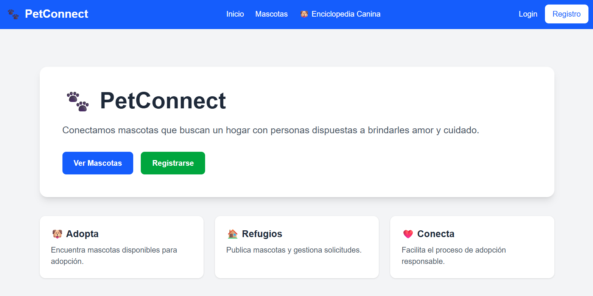
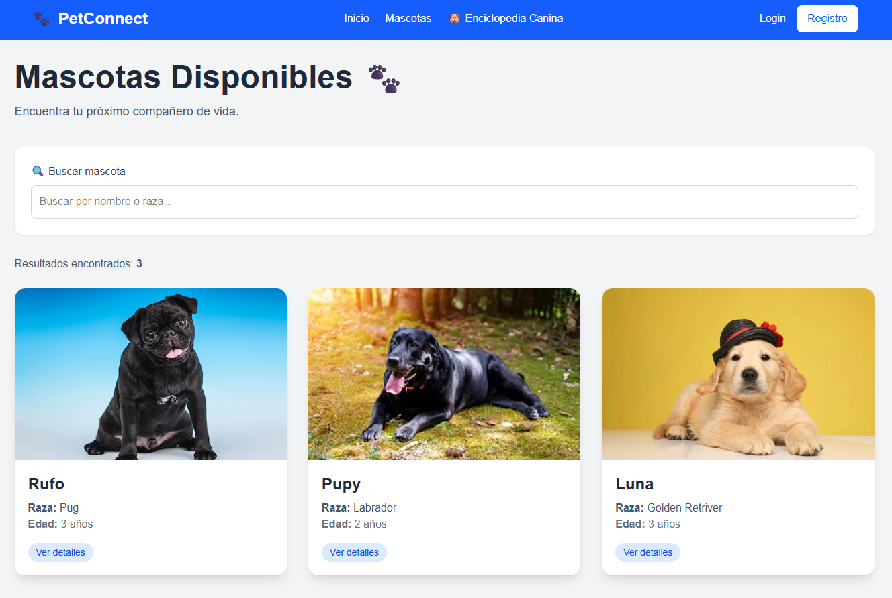
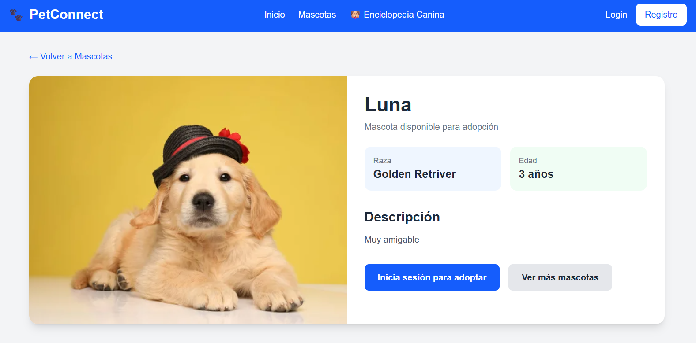
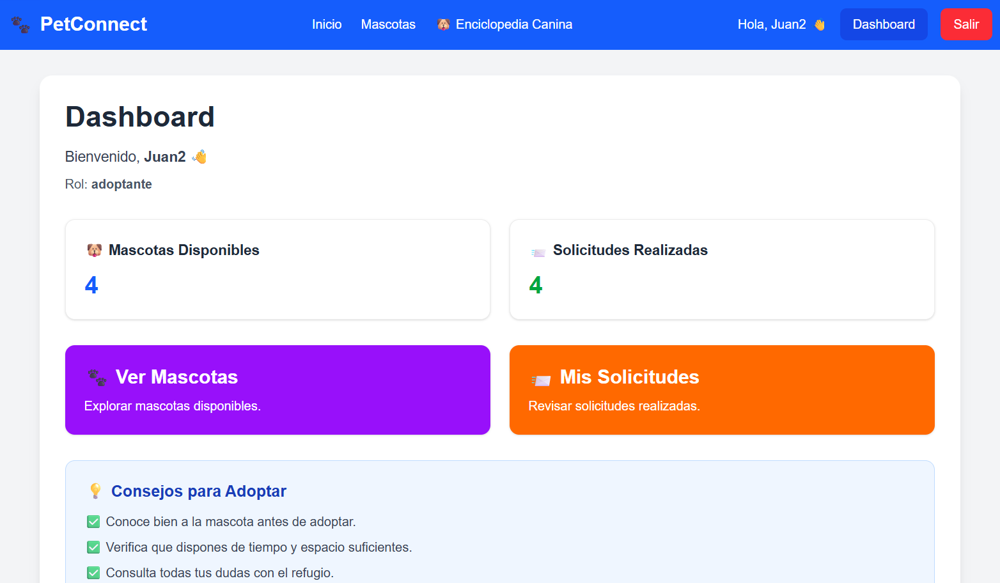
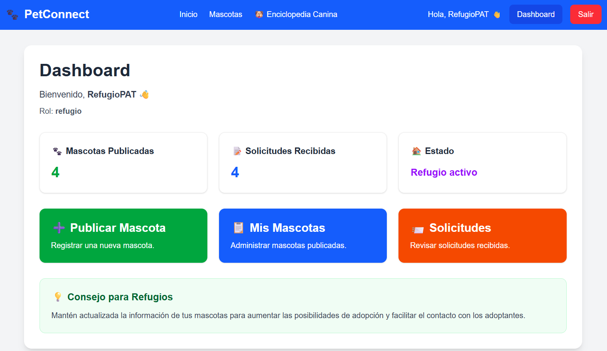
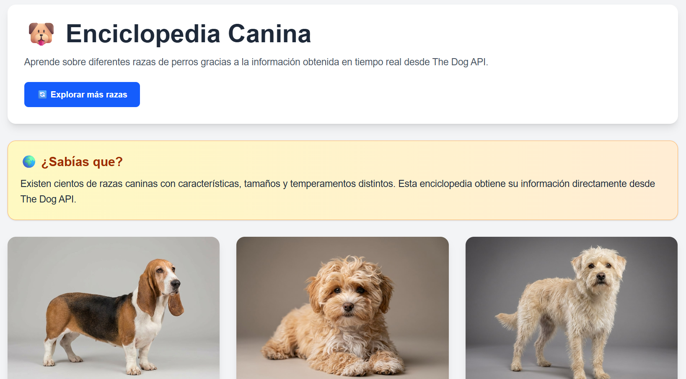

# 🐾 PetConnect

PetConnect es una plataforma web desarrollada para facilitar la adopción responsable de mascotas.

La aplicación conecta refugios que buscan un hogar para sus animales con personas interesadas en adoptar, permitiendo gestionar mascotas, visualizar información detallada y fomentar una adopción informada.

## 🌐 Demo

Demo en vivo: https://petconnect-app-rust.vercel.app/

---

## Credenciales de prueba

### Adoptante

correo: juan2@test.com
contraseña: 12345678

### Refugio

correo: patitas@test.com
contraseña: 12345678

---

## 📸 Capturas de pantalla

- Página de Inicio

- Catálogo de Mascotas

- Detalle de Mascota

- Dashboard de Adoptante

- Dashboard de Refugio

- Enciclopedia Canina


---

## 🛠️ Stack Tecnológico

- Next.js (App Router)
- React
- TypeScript
- Tailwind CSS
- Supabase (PostgreSQL + Authentication)
- The Dog API
- Vercel (Deploy)

---

## ✨ Funcionalidades Implementadas

### Autenticación

- Registro de usuarios.
- Inicio de sesión.
- Cierre de sesión.
- Persistencia de sesión.
- Visualización del usuario autenticado.

### Gestión de Mascotas

- Crear mascotas.
- Listar mascotas.
- Ver detalles de una mascota.
- Editar mascotas.
- Eliminar mascotas.

### Búsqueda y Filtrado

- Búsqueda dinámica de mascotas utilizando `useState`.
- Filtrado por nombre o raza en tiempo real.

### Integración con API Externa

- Consumo de The Dog API.
- Enciclopedia Canina con información sobre razas.
- Visualización de origen, grupo, esperanza de vida y temperamento.

### Experiencia de Usuario

- Dashboard personalizado según el rol.
- Diseño responsive.
- Interfaz moderna desarrollada con Tailwind CSS.

---

## 👥 Roles de Usuario

### 🐾 Adoptante

Puede:

- Registrarse e iniciar sesión.
- Visualizar mascotas disponibles.
- Buscar mascotas por nombre o raza.
- Consultar información detallada de una mascota.
- Acceder a la Enciclopedia Canina.

### 🏠 Refugio

Puede:

- Publicar nuevas mascotas.
- Editar mascotas publicadas.
- Eliminar mascotas.
- Gestionar su catálogo de mascotas.
- Acceder al dashboard administrativo.

---

## 🗄️ Modelo de Datos

### Tabla: profiles

Almacena información de los usuarios registrados.

Campos principales:

- id
- nombre
- email
- rol

### Tabla: mascotas

Almacena las mascotas publicadas por los refugios.

Campos principales:

- id
- nombre
- raza
- edad
- descripcion
- imagen
- refugio_id

### Tabla: solicitudes

Almacena las solicitudes de adopción realizadas por los usuarios.

Campos principales:

- id
- mascota_id
- adoptante_id
- estado

---

## 🚀 Instalación Local

```bash
git clone <URL_DEL_REPOSITORIO>

cd petconnect

npm install

npm run dev
```

---

## 🔑 Variables de Entorno

Crear un archivo `.env.local` con las siguientes variables:

```env
NEXT_PUBLIC_SUPABASE_URL=

NEXT_PUBLIC_SUPABASE_ANON_KEY=

DOG_API_KEY=
```

---

## 📚 Requisitos del Proyecto Cubiertos

- ✅ Next.js con App Router
- ✅ TypeScript
- ✅ Componentes reutilizables
- ✅ useState
- ✅ CRUD completo
- ✅ Supabase
- ✅ PostgreSQL
- ✅ Consumo de API externa
- ✅ Roles de usuario
- ✅ Dashboard personalizado
- ✅ Diseño responsive

---

## 👨‍💻 Autor

Juan D. Saldaña Miranda

Proyecto Integrador - Aplicaciones Web